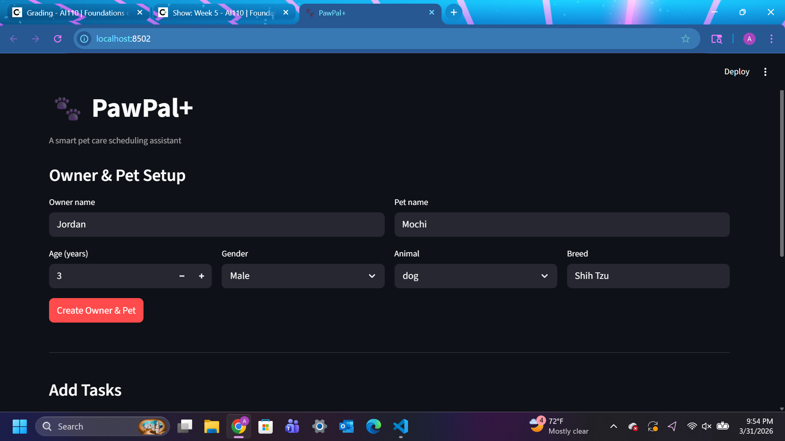

# PawPal+ (Module 2 Project)

You are building **PawPal+**, a Streamlit app that helps a pet owner plan care tasks for their pet.

## Scenario

A busy pet owner needs help staying consistent with pet care. They want an assistant that can:

- Track pet care tasks (walks, feeding, meds, enrichment, grooming, etc.)
- Consider constraints (time available, priority, owner preferences)
- Produce a daily plan and explain why it chose that plan

Your job is to design the system first (UML), then implement the logic in Python, then connect it to the Streamlit UI.

## What you will build

Your final app should:

- Let a user enter basic owner + pet info
- Let a user add/edit tasks (duration + priority at minimum)
- Generate a daily schedule/plan based on constraints and priorities
- Display the plan clearly (and ideally explain the reasoning)
- Include tests for the most important scheduling behaviors

## Getting started

### Setup

```bash
python -m venv .venv
source .venv/bin/activate  # Windows: .venv\Scripts\activate
pip install -r requirements.txt
```

### Suggested workflow

1. Read the scenario carefully and identify requirements and edge cases.
2. Draft a UML diagram (classes, attributes, methods, relationships).
3. Convert UML into Python class stubs (no logic yet).
4. Implement scheduling logic in small increments.
5. Add tests to verify key behaviors.
6. Connect your logic to the Streamlit UI in `app.py`.
7. Refine UML so it matches what you actually built.

## Smarter Scheduling

New features:

- Chronological sorting (get_all_tasks_sorted_by_time): Tasks across all pets are sorted by actual clock time using HH:MM format.
- Flexible filtering (filter_tasks): Tasks can be filtered by pet name, completion status, or both combined.
- Automating recurring tasks (mark_task_complete): When a daily or weekly task is marked complete, a new instance is automatically added with the next due date. 
- Time conflict detection (detect_conflicts): Checks if two tasks for the same or different pet are scheduled at the same time. It returns a warning message if there is a time conflict.

## Testing PawPal+

### Command to run tests

```bash
python -m pytest
```

### What the tests cover

The test suite in tests/test_pawpal.py verifies four core areas:

- **Task completion** — marking a task done correctly flips its `completed` status.
- **Task addition** — adding a task to a pet increases the pet's task count.
- **Chronological sorting** — `get_all_tasks_sorted_by_time` returns tasks in true clock order (AM before PM) across multiple pets, and returns an empty list when there are no tasks.
- **Recurrence logic** — completing a `daily` task auto-creates a new task due tomorrow; completing a `weekly` task creates one due in 7 days; `monthly` tasks are marked done without creating a new instance; and attempting to complete an already-finished or non-existent task is handled gracefully.
- **Conflict detection** — `detect_conflicts` reports exactly one warning per overlapping time slot, names both pets involved, includes the time in the message, and returns an empty list when there are no conflicts.

### Confidence Level

**4 / 5 stars**

The scheduling logic is well-tested through pytest tests across the main happy paths and important edge cases (empty schedules, unknown pets, already-completed tasks, multi-pet time conflicts). However, one star is withheld because the UI layer (`app.py`) has no automated tests, and integration between the Streamlit front-end and the scheduler is only verified manually.

## 📸 Demo

<a href="pawpal_demo.png" target="_blank"></a>.